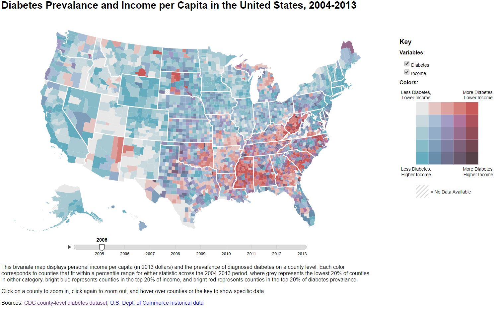

## Chloropeth Bivariate Color Map

This dynamic visualization displays diabetes prevalence per county, income per county, how these two variables are related to each other,
and how they change over time (between 2004 and 2013).

### Running the visualization

In order to run this visualization, you need to have Node.js installed. Then run "npm install" to install our dependencies. It may still be necessary to run "npm install textures"
to install the textures module that we use in our map.

Once you have everything installed, navigate to the directory that this README.md is in on the command line.
Then run the command: python3 -m http.server

Next, in your browser, navigate to http://0.0.0.0:8000/base.html

The visualization should display in the browser.

### Description of files included

Included in this zip file are the following files:

base.html - this the file that defines the basic html functionality, including the structure of the page and styling.

vis.js - implements the D3 library to create our visualization. It also creates all of the interaction capabilities.
All of the action and the layout of our visualization is built in this file.

chroniton.css and chroniton.js - these files are borrowed from the chroniton library (we had issues installing the modules
so we borrowed the source code). We use this library to create our slider to view data per year.

package-lock.json - contains all of our dependencies listed in one file so that a simple npm install will install all of
the dependencies that we use (though this doesn't work perfectly, so installing 'textures' individually may be
necessary).

usCounties.json - lays out the coordinates that we use to create each of the counties in our map.

data.csv - contains the actual data that we use, including diabetes, income, and year (more information about how to
read the data is listed below).

The 'original data' directory contains the original datasets that we used before we combined them to get the data that we
needed. The wrangle.py file manipulates the data to get the data in the right form and to combine the data that we need.
The inflation.py file converts the income values to account for inflation.

### Reading the dataset:

Each row in the dataset represents an individual county in a specific year.

- The DiabetesPercent column represents the estimated percentage of the county population diagnosed with diabetes, dataset available [here](https://www.cdc.gov/diabetes/data/countydata/countydataindicators.html)
- The PersonalIncome column represents the reported personal income per capita of the county, dataset available [here](https://apps.bea.gov/regional/histdata/)
- The CountyName column reports the county name and state
- The FIPS column reports the county FIPS code
- The Year column reports the year associated with the diabetes and income statistics
